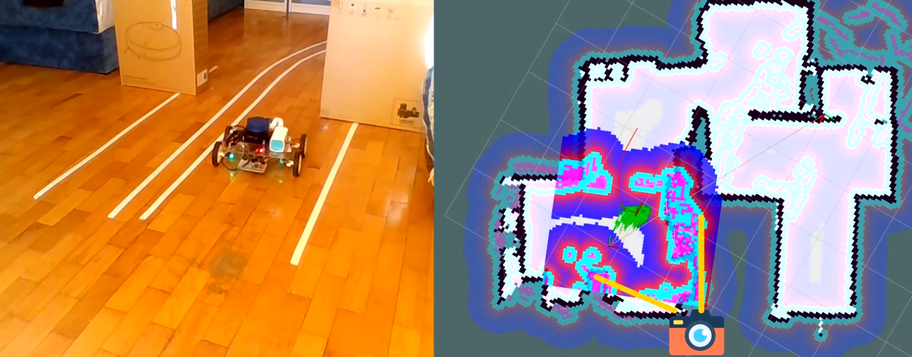

# AWD Autonomous Vehicle based on ROS 

For further references about different aspects of the implementation please check <strong><em>AWD Autonomous Vehicle.pdf</em></strong>.

A detailed visual explanation of the main modules of the robot can be seen here:

